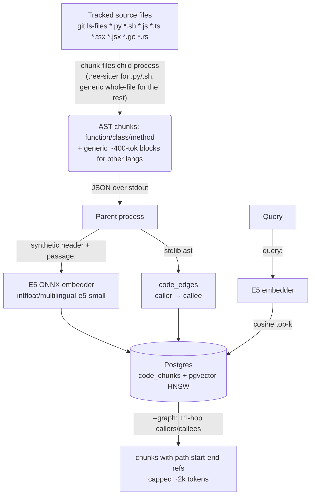

# Code-Aware RAG (Phase 3b)

Semantic retrieval over **code** (function/class chunks), the way `r rules`
(Phase 3a) retrieves rule/doc text. Same Postgres + pgvector store, same local
embedder, plus a static call graph. Exposed as `r code` (CLI) and
`code_lookup` (MCP).

## Architecture

```mermaid
graph TD
    A[Tracked source files<br/>git ls-files *.py *.sh *.js *.ts *.tsx *.jsx *.go *.rs] -->|"chunk-files child process<br/>(tree-sitter for .py/.sh,<br/>generic whole-file for the rest)"| B(AST chunks: function/class/method<br/>+ generic ~400-tok blocks for other langs)
    B -->|JSON over stdout| C[Parent process]
    C -->|"synthetic header + passage:"| D[E5 ONNX embedder<br/>intfloat/multilingual-e5-small]
    C -->|stdlib ast| G[code_edges<br/>caller → callee]
    D --> E[(Postgres<br/>code_chunks + pgvector HNSW)]
    G --> E
    F[Query] -->|"query:"| D2[E5 embedder]
    D2 -->|cosine top-k| E
    E -->|"--graph: +1-hop callers/callees"| H[chunks with path:start-end refs<br/>capped ~2k tokens]
```

## Design decisions

- **tree-sitter for chunk boundaries, stdlib `ast` for call edges.**
  tree-sitter gives byte-exact function/class/method boundaries for both
  Python and Bash through one API (the language registry is a table — adding
  a grammar later is one entry). Call-edge extraction only needs Python and
  is much simpler over `ast.NodeVisitor` than over tree-sitter queries.
- **pgvector over LanceDB/Faiss** — the Postgres+pgvector store is already
  running for Phase 3a; one store, one backup path, one HNSW index pattern
  (`rules_chunks` and `code_chunks` are siblings).
- **e5-small ONNX on CPU** — same embedder as Phase 3a: local, free,
  multilingual (fa/en/fr queries hit English code identifiers), 384-d.
- **Synthetic header before embedding** — each chunk is embedded as
  `"<lang> <symbol> in <path>"` + body, which lifts recall on symbol-name
  queries for near-zero cost.
- **Static-only call graph** — `code_edges(caller_id, callee_symbol,
  resolved_id)` from intra-repo `ast` analysis; `--graph` expands top-k hits
  with 1-hop callers/callees. No dynamic analysis, no cross-repo edges:
  retrieval expansion doesn't need them and they'd cost far more than they
  return.
- **Oversized definitions** (> ~400 est. tokens) are split at inner block
  boundaries; every sub-chunk is re-prefixed with the enclosing signature
  line so it stays self-describing. Token counts use a chars/3 estimate —
  chunk-size control doesn't need tokenizer precision.
- **Process isolation + version pin for tree-sitter (empirical).**
  py-tree-sitter **0.26.0** deterministically segfaulted on macOS arm64 in
  this workload — three independent repros: (1) walking real-size files with
  a live HF `tokenizers` object in the process, (2) interleaving parses with
  onnxruntime embedding calls, (3) reusing one `Parser` across files. The
  dependency is therefore pinned to `>=0.25,<0.26` (0.25.2 passes all
  repros 3/3), **and** chunking runs in a dedicated `chunk-files` child
  process that never creates tokenizer/ONNX objects while the parent
  (embedding + DB) never parses — defense in depth against a known-flaky
  native binding.
- **Iterative AST walk** — the chunker walks materialized `node.children`
  lists with an explicit stack; recursive cursor traversal was part of the
  0.26.0 crash surface and is avoided.
- **Clean module boundary** — `src/code_index.py` + its two tables are
  reachable only through the CLI/MCP query API; nothing inside
  `delegate.py` imports it. The whole feature is extractable as a
  standalone tool.

## Model lifetime

The `intfloat/multilingual-e5-small` model is loaded via ONNX Runtime as a process-wide singleton (`get_model()`). An idle-unload thread automatically frees the model after a period of inactivity to return memory to the OS, governed by the `RAG_MODEL_IDLE_TTL` environment variable (defaults to 900 seconds; set to 0 to disable unloading).

## Incremental reindex

`r code --reindex` diffs `indexed_commit..HEAD` (`git diff --name-only`),
re-chunks only changed files, upserts by `chunk_hash` (unchanged chunks are
re-stamped, not re-embedded), deletes chunks of vanished files/symbols, then
stamps the new `repo_commit`. `--rebuild` re-discovers everything via
`git ls-files -- '*.py' '*.sh' '*.js' '*.jsx' '*.ts' '*.tsx' '*.go' '*.rs'`
(`CODE_GLOBS` — tracked files only, vendored/venv paths can never enter the
index). Both paths are idempotent; a second run is a no-op. Queries print a
one-line stale-index warning when `repo_commit != HEAD`.

## Invocation gate (T-952)

Indexing content nobody consults is wasted work, and consulting was in fact
close to zero: `hooks/code_lookup_gate.py` used to register only on `Read`,
so `Grep`, `Glob`, and any `Bash` invocation of `cat`/`grep`/`sed -n`/`find`
walked straight past it — auto mode routes most exploratory reads through
`Bash`, so the gate almost never fired.

**Gated tools**: `Read` (unchanged: files over
`AI_ROUTER_CODE_LOOKUP_GATE_MAX_BYTES`, default 8192 bytes), `Grep`, `Glob`
(every call — these are inherently repo-wide), and `Bash` when its leading
utility is `cat`, `head`, `tail`, `sed -n`, `grep`, `rg`, `ag`, or
`find … -name`/`-iname`, and only when the first pipeline segment (not
something downstream of a `|`) targets a path inside a git repo.

**Not gated, by design** — under-matching is intentional, since a false
positive here taxes every turn in every repo:
- `git log --grep=...` (and any other command whose leading utility isn't
  itself one of the gated ones — a later flag spelling "grep" never counts)
- a heredoc or here-string (`<<`, `<<<`) — the utility reads inline text
  handed to it by the shell, not a file on disk
- anything downstream of a pipe whose source isn't the filesystem
  (`history | grep foo`)
- `grep`/etc. run over another command's output (`git diff | grep TODO`)
- `Write`/`Edit`, MCP tool calls, and files the agent itself wrote or
  edited earlier in the same session (scanned from the transcript tail)

**Empty-index pass-through**: before blocking, the gate checks whether the
target repo actually has rows in `code_chunks` (`_repo_has_chunks`) and
lets the call through, once, if it does not — sending an agent to an empty
index is worse than not gating at all. This check only runs immediately
before a block would otherwise be issued (never on the cheap/free paths),
and fails toward "let it through" on any DB problem (missing
`POSTGRES_DSN`, connection error, timeout) rather than blocking on an
unproven index.

**Bypass**: a deliberate second attempt on the exact same call always
passes — the gate marks each `(session, tool, target)` it has already
warned about and never blocks it twice. Set `AI_ROUTER_LOOKUP_GATE=off` to
disable every matcher outright (kill switch, checked before anything else
runs). Every decision (block, pass, empty-index, kill-switch-skipped calls
excepted) is appended as one JSON line to
`$AI_ROUTER_LOOKUP_GATE_LOG` (default: `<tempdir>/code-lookup-gate.log`) —
`{"repo", "tool", "target", "decision"}` — so the gate's real hit/miss rate
is measurable instead of assumed.

Registered in `~/.claude/settings.json` as two `PreToolUse` hook entries
(matchers `Read|Grep|Glob` and `Bash`, both invoking this same script) —
that file is owner-owned and not edited by this repo's tooling.

## When it pays off

Honest economics (carried over from the wo-0012 appendix): code retrieval
starts paying for itself on repos **>50 kLOC**, or when **>30% of worker
turns are exploratory reads** despite the repo map. ai-router itself is
~6 kLOC — at this size the repo map alone already answers most "where is X"
questions and the win below is real but modest. The build is justified as
groundwork + portfolio, not by this repo's size.

## Measurement (2026-07-18, live index of this repo)

Task: *"explain how budget caps abort a delegation"*. Three briefings,
character counts measured, token counts = chars/4 (ESTIMATE):

| Briefing | Chars | Est. tokens | vs (a) |
| --- | --- | --- | --- |
| (a) whole relevant files (`delegate.py` + `test_budgets.py`) | 70,837 | ~17,709 | — |
| (b) repo map only | 3,947 | ~986 | −94.4% |
| (c) repo map + `r code` top-5 | 6,526 | ~1,631 | −90.8% |

(b) is cheapest but only names symbols; (c) additionally carries the actual
`check_budget._check` implementation the task asks about, at ~9% of the
whole-file cost. Extrapolation: on a 50 kLOC repo the "whole relevant files"
baseline grows roughly linearly with module size while (c) stays capped at
~2k tokens by construction.

Retrieval quality spot-checks (live):
`r code "where is the budget cap checked"` → top-1
`src/delegate.py:338-346 [check_budget._check]`; `--graph` additionally
pulls the true callers `check_budget` and `test_budget_abort`.

## Multi-repo ingestion (T-953)

Before this, `code_index.py` hardcoded `root = Path(__file__).resolve().parent.parent`
— it only ever indexed ai-router's own checkout, so an agent working in any
other repo had no code memory at all. Every repo under `$HOME/@-github/` is
now indexed into the same `code_chunks` table, discriminated by `repo`.

**Repo roots come from config, not from a path constant.** `get_repo_roots()`
reads `<vault>/data/code_repo_roots.json` (`{"roots": ["/abs/path", ...]}`, a
bare JSON list is also accepted). Adding or removing a repo from the sweep is
a config edit, never a commit. A missing, unreadable, or invalid config falls
back to `_default_repo_roots()` — every directory directly under
`$HOME/@-github/` that contains a `.git` — which is the default with no
config file present at all.

**Exclusions.** `_is_excluded()` skips `node_modules/`, `.venv/`, `venv/`,
`dist/`, `build/`, `__pycache__/`, `.git/`, and `*.min.js` even if a repo
happens to have committed one of those paths — defense in depth on top of
`git ls-files` only ever seeing tracked files in the first place.

**Multi-language chunking.** `CODE_EXT_LANG` maps every extension this
indexer treats as code: `.py .sh .js .jsx .ts .tsx .go .rs`. Only `.py` and
`.sh` get real AST-based chunking through the tree-sitter grammars vendored
in this repo (`tree_sitter_python`, `tree_sitter_bash`) — function/class
boundaries, symbol names, the oversized-def splitter. Grammars for the rest
(`tree-sitter-javascript`/`-typescript`/`-go`/`-rust`) are new dependencies
that need explicit owner approval and were out of scope for this fix, so
those extensions go through `chunk_generic()` instead: the whole file is
split into ~400-token line-blocks with no symbol/parent extraction
(`symbol: null`). Coarser than the AST path, but it makes the file
searchable at all — before this fix a 100%-JS/TS repo (`portfolio`,
`parsi-rtl`, `parsi-rtl-test`) contributed exactly 0 chunks (T-953 defects
#1/#2), which is worse than coarse chunking.

**The only file that legitimately yields 0 chunks is one with 0 bytes of
real (non-whitespace) content — Category A below.** The AST chunker only
emits a chunk for a `function_definition`/`class_definition` node, so a
pure top-level `.py`/`.sh` script (imports + calls, no functions) used to
walk to nothing — this is what was silently swallowing all 29 of
`polycast`'s `experiments/gemini/scripts/*.py` and 4 `.sh` scripts
elsewhere (T-953 Category B, a real bug — see below).
`cmd_chunk_files()` now falls back to `chunk_generic()` (the same
whole-file/~400-token-block chunker used for js/ts/go/rust) whenever the
AST walk for a `.py`/`.sh` file finds zero `def`/`class` nodes, so real
top-level code is searchable at whole-file granularity instead of being
invisible. A file whose content is entirely empty or pure whitespace
still — correctly — produces 0 chunks: confirmed against several 0-byte
`__init__.py` files in `Arix` and `cisco-manager`, there is nothing to
embed. The file is always hashed and recorded in `ingested_files`
regardless of chunk count, so a 0-chunk file is not silently skipped — it
is chunked with a genuinely empty result and never re-chunked until its
content changes.

**Per-repo file counts will always trail `git ls-files` by some amount —
this is Category A, correct by design, not a gap to keep chasing.** The
T-953 follow-up audit found `Arix` at 196/201 tracked files and
`research_toolkit` at 78/90, and traced every missing file by hand: each
one is empty or near-empty (0–~200 bytes — a version string, a one-line
docstring comment, or truly 0 bytes), overwhelmingly `__init__.py`. There
is no content to chunk (see the paragraph above) and, below a couple
hundred bytes, no file has room for a real function or class definition
either. **Audit method for a future re-check:** for a given repo, compare
`(tracked files) − (files with ≥1 code_chunks row)` against
`find <repo> -type f \( -name '*.py' -o -name '*.sh' \) -size -200c | wc -l`
(adjust the glob to whatever extensions that repo uses) run through
`git check-ignore`/`git ls-files` to keep it to tracked files. If the
shortfall is less than or equal to that sub-200-byte count, it is Category
A and does not need investigating further; if it exceeds it, that is
Category B — a real bug — and the first thing to check is whether the
excess files actually have `def`/`class` nodes that the chunker is
somehow still missing (they should not, after the fallback above, but this
is the fast way to notice if that regresses).

**Cross-repo bookkeeping collisions (`ingested_files`) — a second real bug
found in the same follow-up audit.** `ingested_files`'s primary key is
`(collection, file_path)` with no `repo` column at all: fine for
`rules`/`skills`/`sessions`, each a single fixed corpus, but multiple code
repos share plenty of identical relative paths (`__init__.py`,
`install.sh`, `main.py`, ...). Before the fix, two repos with the same
relative path silently shared one hash row — breaking the incremental
skip-check for one of them — and a `--force` rebuild's GC step
(`DELETE ... WHERE collection='code' AND NOT (file_path = ANY(this_repo's
paths))`) deleted every *other* repo's `ingested_files` rows outright,
since none of their paths were in "this repo's paths" either (this is why
a 27-repo `--force` sweep left `ingested_files` holding ~57 rows for the
`code` collection instead of ~1000+). `_ingested_key(repo, path)` now
prefixes every key with `"<repo>::"`; the GC step fetches this repo's own
keys by prefix in Python (not SQL `LIKE` — a repo name containing `_`,
e.g. `research_toolkit`, is a wildcard to `LIKE`) and deletes only the
ones that actually vanished from that repo. This bug never corrupted
`code_chunks` itself (already correctly scoped by its own `repo` column)
— it only corrupted the incremental skip-check and GC bookkeeping in
`ingested_files`. The separate reason an early T-953 measurement showed
13,282 chunks and the final count is 10,151 (see "Final numbers" below) is
the **repo-identity fix** two sections up: before it, `Arix`'s and
`research_toolkit`'s directories were indexed twice each, once under the
old git-remote-derived label (`arix`, `research-toolkit`, 3,354 chunks
combined) and once under the corrected directory-basename label (`Arix`,
`research_toolkit`). The stale old-label rows were deleted by hand
(`DELETE FROM code_chunks WHERE repo = ANY('{arix,research-toolkit}')`)
once the corrected labels were confirmed to hold the real, current data —
a one-time cleanup, not something `ingest()`/`sweep()` do automatically,
since a repo's own GC step only ever touches its own `repo` value and by
design never reaches across to a differently-labeled duplicate of itself.

**Per-repo isolation and failure isolation.** `ingest(force, repo_path=...)`
now takes an explicit repo root instead of always using `Path.cwd()`; every
DB read/write it does is scoped to that repo's name, which for the sweep
path is **the root directory's own basename** — never the git remote URL.
Two different checkouts can share (or be misconfigured to share) one git
remote (T-953 defect: `parsi-rtl-test`'s `origin` was still `parsi-rtl.git`),
and remote-derived identity let them collide under one `code_chunks.repo`
value, with a `--force` sweep of one silently GC-deleting the other's rows.
`get_repo_roots()` already guarantees each swept root is a distinct sibling
directory, so its basename is both unique and matches the casing everyone
actually uses (previously "arix" from the lowercase remote vs. the real
`Arix` directory on disk). The single-repo `project_info()` used by `r code`
when run from inside a checkout is unchanged (still remote-derived, matching
the rest of the ledger's project tagging) — only the multi-repo sweep's
`_project_info_for()` changed. `sweep()` calls
`ingest()` once per configured root and catches any exception per repo
(bad encoding, broken symlink, permission-denied directory, ...), logging
and moving on to the next repo — one bad repo never aborts the sweep. A
repo whose `.git` is not a real git repository at all is caught one level
lower, inside `ingest()`'s own `git ls-files` call (`CalledProcessError`),
logged (`code_index: <path> is not readable as a git repo, skipping: ...`)
the same way, and treated as 0 files rather than propagating — verified
directly: a repo whose `.git/HEAD` is garbage sits ahead of a real repo in
a 2-repo sweep, the broken one logs and is skipped, and the real repo's
row count in `code_chunks` is unchanged before and after. The one
exception that is deliberately NOT swallowed is `psycopg.OperationalError`:
Postgres being down is not a per-repo problem, so it propagates so the
caller reports the real outage instead of it looking like 30-odd unrelated
repo failures. A single unreadable file inside an otherwise-good repo is
isolated at an even finer grain — `ingest()` skips just that file (logged,
`files_failed` counted) and keeps indexing the rest of the repo.

**Sweep budget and resume.** `sweep(budget_seconds=...)` (env
`RAG_CODE_SWEEP_BUDGET_S`, default 1500s) stops starting new repos once the
budget is spent — a repo already in progress finishes, but the next one is
deferred. Which repo to resume from is persisted round-robin in
`<vault>/data/code_sweep_state.json` (`{"next_index": N}`), so a cold repo
that eats the whole 30-minute launchd window on one run does not starve the
same tail of the repo list on every subsequent run — the next sweep picks up
where the last one left off. `src/rag_ingest.py --collection code` calls
`sweep()` (not the single-repo `ingest()`) precisely so the launchd job
`com.ai-router.rag-sweep` gets this behavior; `r code --reindex`/`--rebuild`
(and `--receipt`'s single-file ingest) still call `ingest()` directly,
scoped to the cwd's own repo, unchanged.

**Cross-repo search.** `r code --all-repos "<query>"` (and the `code_lookup`
MCP tool's `all_repos: true` argument) searches every repo's chunks instead
of just the cwd-inferred one, and prefixes each hit with its repo name
(`[repo] path:start-end [symbol]`) — this labelling is what makes a snippet
written in one repo findable and reusable from another. Default behavior
(no `--all-repos`) is unchanged: one repo, no prefix, same output format as
before this change.

**Final numbers (real cold `--force` ingest, all fixes applied, measured
against the live DB, not estimated):** 24 repos, 10,151 chunks, 1,133 files
recorded in `ingested_files` (of which 1,080 have ≥1 chunk — the rest are
Category A above). Per-repo file coverage against `git ls-files`:
`polycast` 49/49 (was 20/49 pre-fix), `portfolio` 95/95 (was 0/95),
`parsi-rtl` 6/6 and `parsi-rtl-test` 8/8 (both were 0/6, 0/8),
`agent-constitution` 31/31, `Arix` 196/201 and `research_toolkit` 78/90
(both Category A — see the audit-method paragraph above). No repo in the
sweep has an unexplained gap.
