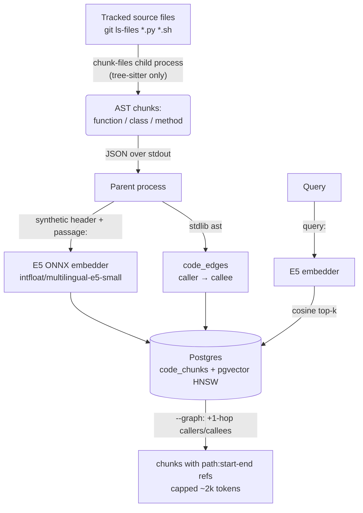

# Code-Aware RAG (Phase 3b)

Semantic retrieval over **code** (function/class chunks), the way `r rules`
(Phase 3a) retrieves rule/doc text. Same Postgres + pgvector store, same local
embedder, plus a static call graph. Exposed as `r code` (CLI) and
`code_lookup` (MCP).

## Architecture

```mermaid
graph TD
    A[Tracked source files<br/>git ls-files *.py *.sh] -->|"chunk-files child process<br/>(tree-sitter only)"| B(AST chunks:<br/>function / class / method)
    B -->|JSON over stdout| C[Parent process]
    C -->|"synthetic header + passage:"| D[E5 ONNX embedder<br/>intfloat/multilingual-e5-small]
    C -->|stdlib ast| G[code_edges<br/>caller → callee]
    D --> E[(Postgres<br/>code_chunks + pgvector HNSW)]
    G --> E
    F[Query] -->|"query:"| D2[E5 embedder]
    D2 -->|cosine top-k| E
    E -->|"--graph: +1-hop callers/callees"| H[chunks with path:start-end refs<br/>capped ~2k tokens]
```

## Design decisions

- **tree-sitter for chunk boundaries, stdlib `ast` for call edges.**
  tree-sitter gives byte-exact function/class/method boundaries for both
  Python and Bash through one API (the language registry is a table — adding
  a grammar later is one entry). Call-edge extraction only needs Python and
  is much simpler over `ast.NodeVisitor` than over tree-sitter queries.
- **pgvector over LanceDB/Faiss** — the Postgres+pgvector store is already
  running for Phase 3a; one store, one backup path, one HNSW index pattern
  (`rules_chunks` and `code_chunks` are siblings).
- **e5-small ONNX on CPU** — same embedder as Phase 3a: local, free,
  multilingual (fa/en/fr queries hit English code identifiers), 384-d.
- **Synthetic header before embedding** — each chunk is embedded as
  `"<lang> <symbol> in <path>"` + body, which lifts recall on symbol-name
  queries for near-zero cost.
- **Static-only call graph** — `code_edges(caller_id, callee_symbol,
  resolved_id)` from intra-repo `ast` analysis; `--graph` expands top-k hits
  with 1-hop callers/callees. No dynamic analysis, no cross-repo edges:
  retrieval expansion doesn't need them and they'd cost far more than they
  return.
- **Oversized definitions** (> ~400 est. tokens) are split at inner block
  boundaries; every sub-chunk is re-prefixed with the enclosing signature
  line so it stays self-describing. Token counts use a chars/3 estimate —
  chunk-size control doesn't need tokenizer precision.
- **Process isolation + version pin for tree-sitter (empirical).**
  py-tree-sitter **0.26.0** deterministically segfaulted on macOS arm64 in
  this workload — three independent repros: (1) walking real-size files with
  a live HF `tokenizers` object in the process, (2) interleaving parses with
  onnxruntime embedding calls, (3) reusing one `Parser` across files. The
  dependency is therefore pinned to `>=0.25,<0.26` (0.25.2 passes all
  repros 3/3), **and** chunking runs in a dedicated `chunk-files` child
  process that never creates tokenizer/ONNX objects while the parent
  (embedding + DB) never parses — defense in depth against a known-flaky
  native binding.
- **Iterative AST walk** — the chunker walks materialized `node.children`
  lists with an explicit stack; recursive cursor traversal was part of the
  0.26.0 crash surface and is avoided.
- **Clean module boundary** — `src/code_index.py` + its two tables are
  reachable only through the CLI/MCP query API; nothing inside
  `delegate.py` imports it. The whole feature is extractable as a
  standalone tool.

## Model lifetime

The `intfloat/multilingual-e5-small` model is loaded via ONNX Runtime as a process-wide singleton (`get_model()`). An idle-unload thread automatically frees the model after a period of inactivity to return memory to the OS, governed by the `RAG_MODEL_IDLE_TTL` environment variable (defaults to 900 seconds; set to 0 to disable unloading).

## Incremental reindex

`r code --reindex` diffs `indexed_commit..HEAD` (`git diff --name-only`),
re-chunks only changed files, upserts by `chunk_hash` (unchanged chunks are
re-stamped, not re-embedded), deletes chunks of vanished files/symbols, then
stamps the new `repo_commit`. `--rebuild` re-discovers everything via
`git ls-files -- '*.py' '*.sh'` (tracked files only — vendored/venv paths
can never enter the index). Both paths are idempotent; a second run is a
no-op. Queries print a one-line stale-index warning when
`repo_commit != HEAD`.

## Invocation gate (T-952)

Indexing content nobody consults is wasted work, and consulting was in fact
close to zero: `hooks/code_lookup_gate.py` used to register only on `Read`,
so `Grep`, `Glob`, and any `Bash` invocation of `cat`/`grep`/`sed -n`/`find`
walked straight past it — auto mode routes most exploratory reads through
`Bash`, so the gate almost never fired.

**Gated tools**: `Read` (unchanged: files over
`AI_ROUTER_CODE_LOOKUP_GATE_MAX_BYTES`, default 8192 bytes), `Grep`, `Glob`
(every call — these are inherently repo-wide), and `Bash` when its leading
utility is `cat`, `head`, `tail`, `sed -n`, `grep`, `rg`, `ag`, or
`find … -name`/`-iname`, and only when the first pipeline segment (not
something downstream of a `|`) targets a path inside a git repo.

**Not gated, by design** — under-matching is intentional, since a false
positive here taxes every turn in every repo:
- `git log --grep=...` (and any other command whose leading utility isn't
  itself one of the gated ones — a later flag spelling "grep" never counts)
- a heredoc or here-string (`<<`, `<<<`) — the utility reads inline text
  handed to it by the shell, not a file on disk
- anything downstream of a pipe whose source isn't the filesystem
  (`history | grep foo`)
- `grep`/etc. run over another command's output (`git diff | grep TODO`)
- `Write`/`Edit`, MCP tool calls, and files the agent itself wrote or
  edited earlier in the same session (scanned from the transcript tail)

**Empty-index pass-through**: before blocking, the gate checks whether the
target repo actually has rows in `code_chunks` (`_repo_has_chunks`) and
lets the call through, once, if it does not — sending an agent to an empty
index is worse than not gating at all. This check only runs immediately
before a block would otherwise be issued (never on the cheap/free paths),
and fails toward "let it through" on any DB problem (missing
`POSTGRES_DSN`, connection error, timeout) rather than blocking on an
unproven index.

**Bypass**: a deliberate second attempt on the exact same call always
passes — the gate marks each `(session, tool, target)` it has already
warned about and never blocks it twice. Set `AI_ROUTER_LOOKUP_GATE=off` to
disable every matcher outright (kill switch, checked before anything else
runs). Every decision (block, pass, empty-index, kill-switch-skipped calls
excepted) is appended as one JSON line to
`$AI_ROUTER_LOOKUP_GATE_LOG` (default: `<tempdir>/code-lookup-gate.log`) —
`{"repo", "tool", "target", "decision"}` — so the gate's real hit/miss rate
is measurable instead of assumed.

Registered in `~/.claude/settings.json` as two `PreToolUse` hook entries
(matchers `Read|Grep|Glob` and `Bash`, both invoking this same script) —
that file is owner-owned and not edited by this repo's tooling.

## When it pays off

Honest economics (carried over from the wo-0012 appendix): code retrieval
starts paying for itself on repos **>50 kLOC**, or when **>30% of worker
turns are exploratory reads** despite the repo map. ai-router itself is
~6 kLOC — at this size the repo map alone already answers most "where is X"
questions and the win below is real but modest. The build is justified as
groundwork + portfolio, not by this repo's size.

## Measurement (2026-07-18, live index of this repo)

Task: *"explain how budget caps abort a delegation"*. Three briefings,
character counts measured, token counts = chars/4 (ESTIMATE):

| Briefing | Chars | Est. tokens | vs (a) |
| --- | --- | --- | --- |
| (a) whole relevant files (`delegate.py` + `test_budgets.py`) | 70,837 | ~17,709 | — |
| (b) repo map only | 3,947 | ~986 | −94.4% |
| (c) repo map + `r code` top-5 | 6,526 | ~1,631 | −90.8% |

(b) is cheapest but only names symbols; (c) additionally carries the actual
`check_budget._check` implementation the task asks about, at ~9% of the
whole-file cost. Extrapolation: on a 50 kLOC repo the "whole relevant files"
baseline grows roughly linearly with module size while (c) stays capped at
~2k tokens by construction.

Retrieval quality spot-checks (live):
`r code "where is the budget cap checked"` → top-1
`src/delegate.py:338-346 [check_budget._check]`; `--graph` additionally
pulls the true callers `check_budget` and `test_budget_abort`.
